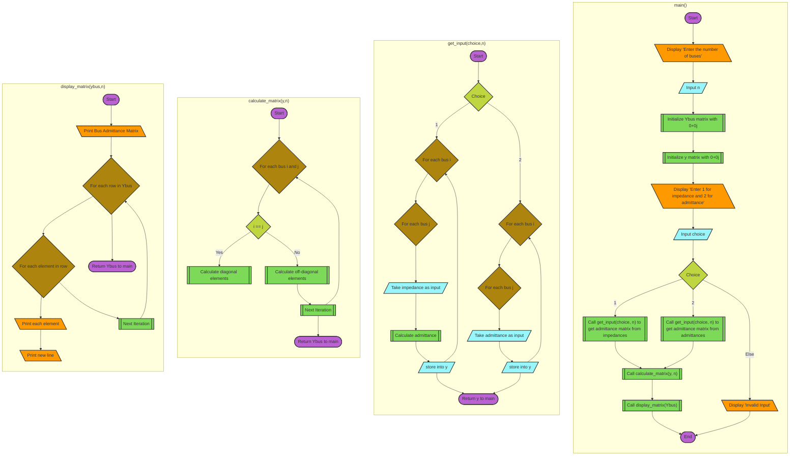
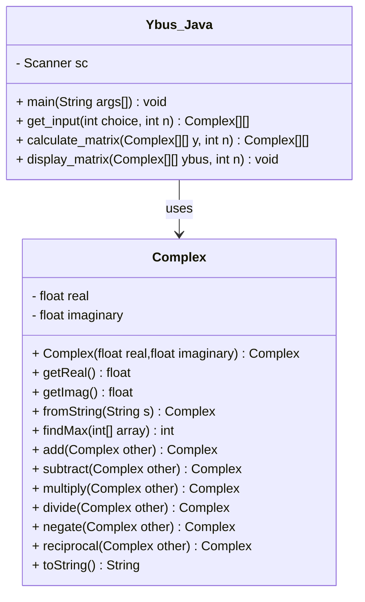

<script src="https://cdn.jsdelivr.net/npm/mathjax@3/es5/tex-mml-chtml.js"></script>
## View this project on github:[Github - Bus Admittance Matrix](https://github.com/Sree2011/bus-admittance-matrix/)

# Generate Bus Admittance Matrix

# Formulas for calculation

$$

\begin{equation*}

    \begin{bmatrix} 
    I_1 \\
    I_2 \\ 
    \vdots \\ 
    I_i \\ 
    \vdots 
    \\ I_n 
    \end{bmatrix}

    =

    \begin{bmatrix} 
    Y_{11} & Y_{12} & \cdots & Y_{1i} & \cdots & Y_{1n} \\
    Y_{21} & Y_{22} & \cdots & Y_{2i} & \cdots & Y_{2n} \\
    \vdots & \vdots & \ddots & \vdots & \ddots & \vdots \\ 
    Y_{i1} & Y_{i2} & \cdots & Y_{ii} & \cdots & Y_{in} \\ 
    \vdots & \vdots & \ddots & \vdots & \ddots & \vdots \\ 
    Y_{n1} & Y_{n2} & \cdots & Y_{ni} & \cdots & Y_{nn}
    \end{bmatrix}
    \begin{bmatrix} 
    V_1 \\ 
    V_2 \\ 
    \vdots \\ 
    V_i \\ 
    \vdots \\ 
    V_n 
    \end{bmatrix}

\end{equation*}
$$

$$
[I_{bus}] = [Y_{bus}][V_{bus}]
$$

**Formulas for calculation:**

For diagonal elements,\
$Y_{ii} = \sum_{j=0}^{n}y_{ij}$\
For off-diagonal elements,\
$Y_{ij} = Y_{ji} = -y_{ij}$


# Algorithm

1. **Initialize Variables**:
   - Get the number of buses from the user.
   - Initialize the line admittance matrix and bus admittance matrix with zeros.

2. **Define Functions**:
   - **Function 1: get_input**
     - Input: User choice (impedance or admittance) and number of buses.
     - Output: Line Admittance Matrix.
     - Description: Gets the input from the user based on the choice and calculates admittance values.

   - **Function 2: calculate_admittance_matrix**
     - Input: Line Admittance Matrix.
     - Output: Bus Admittance Matrix.
     - Description: Forms the bus admittance matrix using the admittance value matrix.

   - **Function 3: print_admittance_matrix**
     - Input: Bus Admittance Matrix.
     - Output: None (prints the matrix to the console).
     - Description: Prints the bus admittance matrix.

3. **Main Function**:
   - Step 1: Ask the user to enter the number of buses.
   - Step 2: Ask the user to choose between impedance or admittance.
   - Step 3: Call `get_input` to get the line admittance matrix.
   - Step 4: Call `calculate_admittance_matrix` to form the bus admittance matrix.
   - Step 5: Call `print_admittance_matrix` to display the bus admittance matrix.


## Flowchart




## Class Diagram


**Adding annotations for MATLAB and Python implementations:**
- **note for Complex**:\
In MATLAB and Python, inbuilt libraries are used instead of this custom Complex class.\
- **note for Ybus_Java**:\
The MATLAB and Python versions implement similar functionality using inbuilt functions and data structures.


## Pseudocode

```pseudocode
BEGIN
    INITIALIZE Ybus matrix of size (n x n) with 0+0j
    INITIALIZE y matrix of size (n x n) with 0+0j

    FUNCTION get_input(choice, n)
        IF choice == 1 THEN
            FOR each bus i from 1 to n DO
                FOR each bus j from 1 to n DO
                    PRINT "Enter the impedance between bus i and bus j:"
                    yij = INPUT complex number
                    y[i][j] = 1 / yij
                END FOR
            END FOR
        ELSE IF choice == 2 THEN
            FOR each bus i from 1 to n DO
                FOR each bus j from 1 to n DO
                    PRINT "Enter the admittance between bus i and bus j:"
                    y[i][j] = INPUT complex number
                END FOR
            END FOR
        END IF
        RETURN y
    END FUNCTION

    FUNCTION calculate_matrix(y, n)
        FOR each bus i from 1 to n DO
            FOR each bus j from 1 to n DO
                IF i == j THEN
                    FOR each bus k from 1 to n DO
                        Ybus[i][j] = Ybus[i][j] + y[i][k]
                    END FOR
                ELSE
                    Ybus[i][j] = -y[i][j]
                END IF
            END FOR
        END FOR
        RETURN Ybus
    END FUNCTION

    FUNCTION display_matrix(Ybus)
        PRINT "Bus Admittance Matrix:"
        FOR each row in Ybus DO
            FOR each element in row DO
                PRINT element
            END FOR
            PRINT new line
        END FOR
    END FUNCTION
   
   PRINT "Enter the number of buses:"
   n = INPUT integer
   PRINT "Enter 1 for impedance and 2 for admittance"
   choice = INPUT integer

    y = get_input(choice, n)
    Ybus = calculate_matrix(y, n)
    display_matrix(Ybus)
END

```

## Documentation

Here are the links to the implementations:

1. [Python](./docs/html/namespaceYbus__Python.html)
2. [Java](./docs/html/classes.html)
3. [MATLAB](./docs/html/Ybus__matlab_8m.html)

## Documentation Tools

Here are the links to the documentation tools I used:

| Tool             | Link                                                                 | Description                                                                 |
|:----------------:|:--------------------------------------------------------------------:|:---------------------------------------------------------------------------:|
| Doxygen          | [Link to doxygen](https://doxygen.nl/index.html)                     | Used to generate documentation for java and python files                    |
| Octave Publish Command | [Octave documentation](https://www.gnu.org/software/octave/doc/interpreter/Publishing-Markdown.html) | Utilized to convert MATLAB scripts into documentation with integrated code, comments, and results |
| GitHub Actions   | [GitHub Actions documentation](https://docs.github.com/en/actions)   | Automated the generation and deployment of documentation. GitHub Actions helped streamline our CI/CD pipeline. |


## References

[1] Hadi Saadat, *"Power System Analysis"*. Psa Pub, United States, 2010.\
[2] Mohammad Shahidehpour; Yaoyu Wang, "Appendix C: IEEE30 Bus System Data," in Communication and Control in Electric Power Systems: Applications of Parallel and Distributed Processing , IEEE, 2003, pp.493-495, doi: 10.1002/0471462926.app3.


