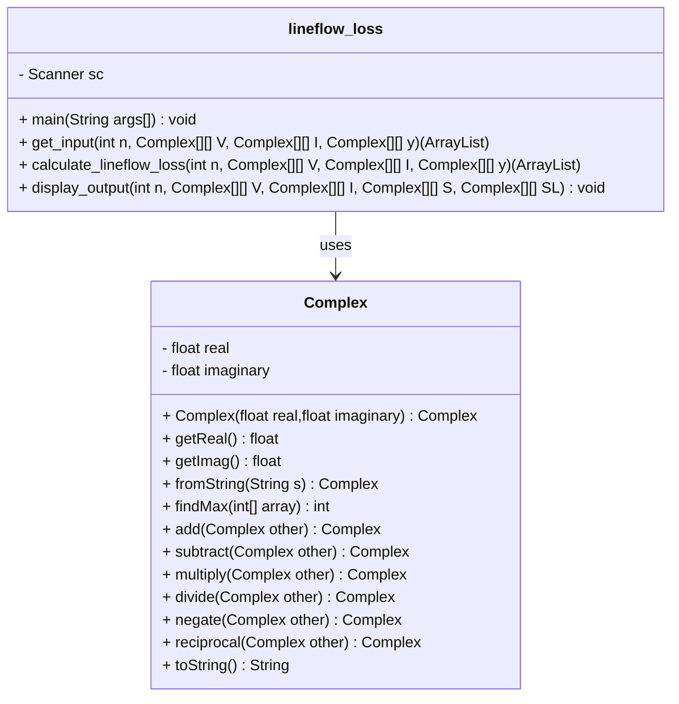

# Line Flows and Line Losses

Finding line flows and line losses in a power system.

## Formulas for Calculation

### Voltage Between Buses

- **Bus i and bus j**:
  $$
  V_{ij} = V_{i} - V_{j}
  $$

- **Bus j and bus i**:
  $$
  V_{ji} = V_{j} - V_{i}
  $$

### Current Calculation

- **Current from bus i to bus j**:
  $$
  I_{ij} = y_{ij}(V_i - V_j) + y_{i0} V_i
  $$

- **Current from bus j to bus i**:
  $$
  I_{ji} = y_{ji}(V_j - V_i) + y_{j0} V_i
  $$

### Line Flows

- **From bus i to bus j**:
  $$
  S_{ij} = V_{ij}I_{ij}^{*}
  $$

- **From bus j to bus i**:
  $$
  S_{ji} = V_{ji}I_{ji}^{*}
  $$

### Line Losses

  $$
  S_{L_{ij}} = S_{ij} + S_{ji}
  $$

## Algorithm

### **Main Program:**
**Input:**
- Number of buses, `n`
- User choice for impedance or admittance

**Process:**
- Initialize matrices `V`, `I`, and `y`
- Get input for voltage and current at each bus
- Depending on the user choice, input impedance or admittance values and update `y` matrix
- Calculate line flows and line losses

**Output:**
- Display line flows and line losses for each bus pair

### **Get Input from the User:**
**Input:**
- User choice (1 for impedance, 2 for admittance)
- Voltage at each bus, ` V[i, i] `
- Current at each bus, ` I[i, i] `
- Impedance or admittance values between buses

**Process:**
- For each bus, input voltage and current values
- If choice is impedance, input impedance values, calculate admittance, and update ` y ` matrix
- If choice is admittance, input admittance values and update ` y ` matrix

**Output:**
- Return matrices ` V `, ` I `, and ` y `

### **Calculate Line Flows and Line Losses:**
**Input:**
- Number of buses, ` n `
- Matrices ` V `, ` I `, and ` y `

**Process:**
- Initialize matrices ` S ` and ` SL `
- For each bus pair, calculate voltage differences
- For each bus pair, calculate current values using admittance and voltage differences
- For each bus pair, calculate line flows and line losses

**Output:**
- Return matrices ` S ` and ` SL `

### **Display the Line Flows and Line Losses:**
**Input:**
- Matrices ` V `, ` I `, ` S `, and ` SL `
- Number of buses, ` n `

**Process:**
- Create a list named `data`
- For each bus pair, add bus pair information, voltage, current, line flow, and line loss to `data`
- Declare headers and display them
- Display data for each bus pair

**Output:**
- Display line flows and line losses for each bus pair

## Class Diagram

## Documentation

|Language|Link|
|:---:|:---:|
|Python|[Lineflows_python](./docs/html/namespacelineflow__loss.html)|
|Java|[Lineflows_java](./docs/html/lineflow__loss_8java.html)|
|MATLAB|[Lineflows_matlab](./docs/html/lineflow__loss_8m.html)|